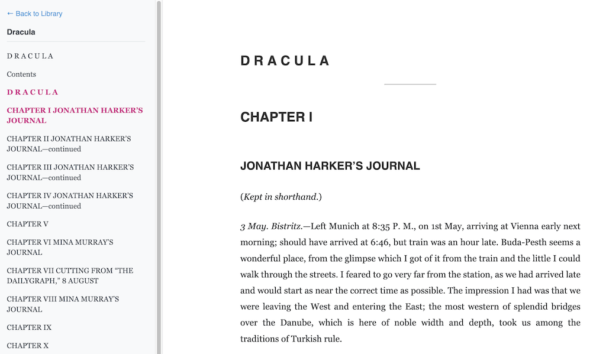

# reader 3 with AI Integration



A lightweight, self-hosted EPUB reader that lets you read through EPUB books one chapter at a time, now enhanced with DeepSeek AI integration for interactive reading assistance.

**Note**: This is a derivative project based on the original reader3, extended with AI capabilities for enhanced reading experience.

## Overview

This project was originally 90% vibe coded to illustrate how one can very easily [read books together with LLMs](https://x.com/karpathy/status/1990577951671509438). The AI-enhanced version adds DeepSeek integration, allowing you to chat with an AI assistant while reading, getting chapter analysis, explanations, and answers to your questions.

## Features

### Core Reading Features
- Lightweight EPUB reader with chapter-by-chapter navigation
- Self-hosted solution for privacy and control
- Simple library management
- Reading progress tracking

### AI Integration Features
- **AI Chat Panel**: Real-time conversation with DeepSeek AI
- **Context-Aware**: AI can access current chapter content
- **Chapter Analysis**: Get summaries and explanations
- **Question Answering**: Ask questions about the content
- **Chinese Support**: Full Chinese language support

## Usage

The project uses [uv](https://docs.astral.sh/uv/). 

### 1. Process EPUB Files

Download an EPUB file (e.g., from [Project Gutenberg](https://www.gutenberg.org/)) and process it:

```bash
uv run reader3.py dracula.epub
```

This creates the directory `dracula_data`, which registers the book to your local library.

### 2. Set Up AI Integration (Optional)

To enable AI features, set your DeepSeek API key:

```bash
export DEEPSEEK_API_KEY="your_deepseek_api_key_here"
```

### 3. Start the Server

```bash
uv run server.py
```

Visit [localhost:8123](http://localhost:8123/) to see your current Library.

## AI-Enhanced Reading

### Using the AI Reader

1. From the library page, click "Read with AI" on any book
2. The AI-enhanced reader will open with the current chapter
3. Click the 🤖 button in the bottom-right corner to open the AI chat panel
4. Ask questions about the current chapter content

### Example Questions
- "请总结这一章的主要内容" (Summarize this chapter)
- "解释一下这个概念" (Explain this concept)
- "这个人物在故事中扮演什么角色？" (What role does this character play?)
- "这个技术术语是什么意思？" (What does this technical term mean?)

### Reading Progress Tracking
- **Continue Reading**: Automatically resumes from your last read position
- **Progress Display**: Shows your reading progress in the library
- **Cross-Device**: Progress is saved in a local database

## Technical Details

### Project Structure
- `reader3.py` - EPUB parser (original functionality)
- `server.py` - Enhanced server with AI routes and reading progress
- `deepseek_client.py` - DeepSeek API client
- `templates/reader_with_ai.html` - AI-enhanced reader interface
- `templates/library.html` - Updated library with progress tracking

### AI Integration
- Uses DeepSeek Chat API
- Context length limited to 2000 characters per chapter
- Real-time conversation support
- Error handling for API issues

## License

MIT

## Notes

- This project is provided as-is for inspiration
- Code is ephemeral - feel free to modify with your LLM
- No official support is provided
- AI features require a valid DeepSeek API key
- Consider API usage costs when using AI features extensively

## Troubleshooting

### AI Features Not Working
- Check that `DEEPSEEK_API_KEY` environment variable is set
- Verify your API key is valid
- Check server logs for initialization messages

### Reading Progress Issues
- Progress is stored in `reading_progress.db` SQLite database
- Deleting the database file will reset all progress

### General Issues
- Ensure all dependencies are installed with `uv sync`
- Check that EPUB files are properly processed
- Verify server is running on the correct port (8123)